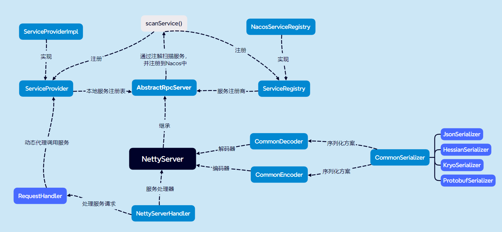

# 一个相对简易的RPC框架
MyRPC 是一款基于 Nacos 实现的 RPC 框架。网络传输实现了基于 Java 原生 Socket 与 Netty 版本，并且实现了多种序列化与负载均衡算法。
## 主要架构

## 服务端主要类的框架图

## 特性

- 实现了基于 Java 原生 Socket 传输与 Netty 传输两种网络传输方式
- 实现了四种序列化算法，Json 方式、Kryo 算法、Hessian 算法与 Google Protobuf 方式（默认采用 Kryo方式序列化）
- 实现了两种负载均衡算法：随机算法与轮转算法
- 使用 Nacos 作为注册中心，管理服务提供者信息
- 消费端如采用 Netty 方式，会复用 Channel 避免多次连接
- 如消费端和提供者都采用 Netty 方式，会采用 Netty 的心跳机制，保证连接
- 接口抽象良好，模块耦合度低，网络传输、序列化器、负载均衡算法可配置
- 实现自定义的通信协议
- 服务提供侧自动注册服务

## 项目模块概览

- **rpc-api**	——	通用接口
- **rpc-common**	——	实体对象、工具类等公用类
- **rpc-core**	——	框架的核心实现
- **test-client**	——	测试用消费侧
- **test-server**	——	测试用服务侧

## 启动
以Netty版本为例, Socket版本同理
- 首先启动本地Nacos服务(Windows版)
```
startup.cmd -m standalone
```
- 启动test-server下的NettyTestServer类
- 启动test-client下的NettyTestClient类